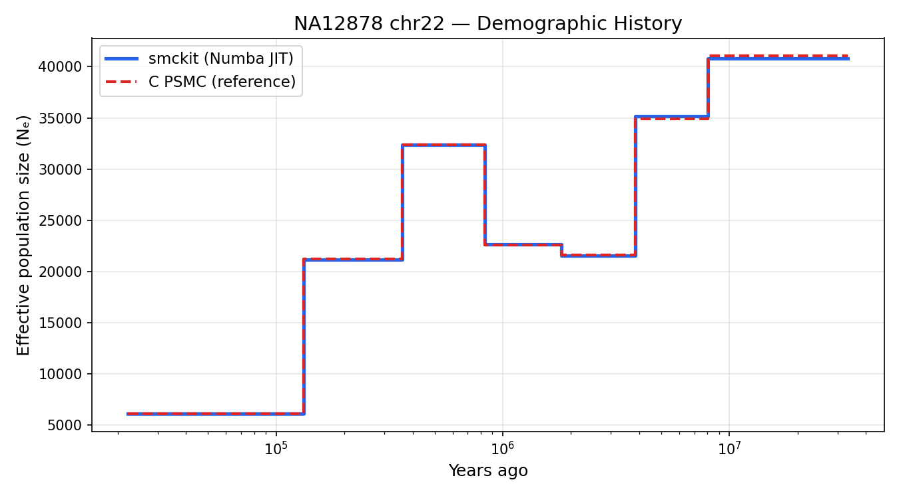
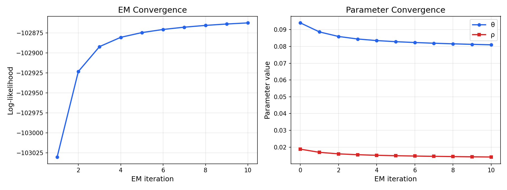
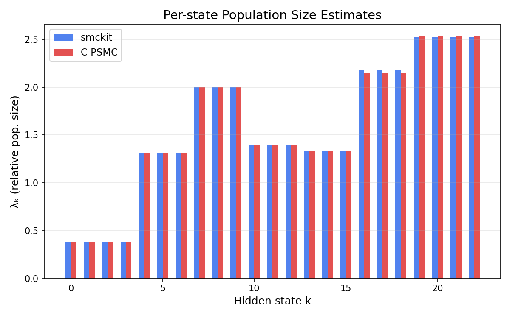

# Gallery

Example outputs from smckit PSMC on NA12878 chromosome 22 (1000 Genomes
high-coverage data, 10 EM iterations, pattern `4+5*3+4`).

## Demographic History

The inferred effective population size N_e(t) as a step function over time.
The smckit Numba JIT result (blue) overlays the original C PSMC reference
(red dashed) with lambda correlation > 0.999.



```python
import smckit

data = smckit.io.read_psmcfa("NA12878_chr22.psmcfa")
data = smckit.tl.psmc(data, pattern="4+5*3+4", n_iterations=10, tr_ratio=5.0)
smckit.pl.demographic_history(data, label="smckit")
```

## EM Convergence

Log-likelihood and parameter convergence across EM iterations. The
log-likelihood increases monotonically (as guaranteed by EM), and
theta/rho stabilize within 5-10 iterations.



## Per-state Lambda Comparison

Side-by-side comparison of the relative population size estimates
(lambda_k) for each hidden state. The smckit and C PSMC values agree
to within 1% across all 23 states.


